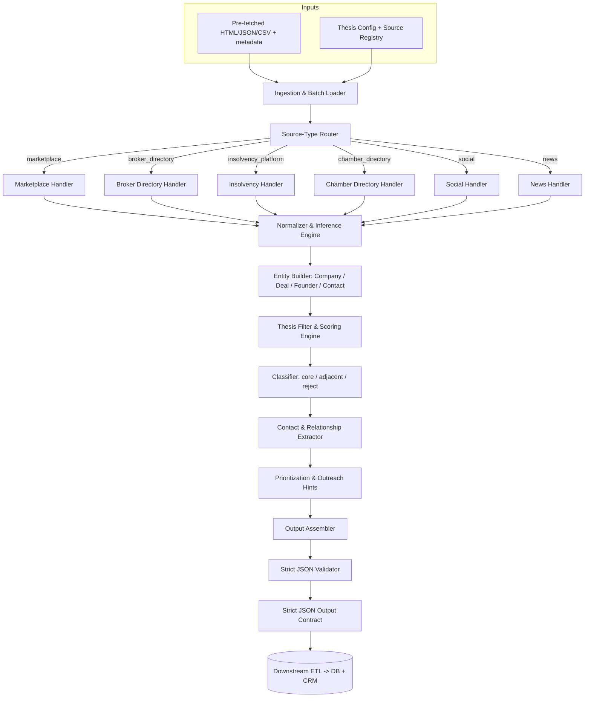
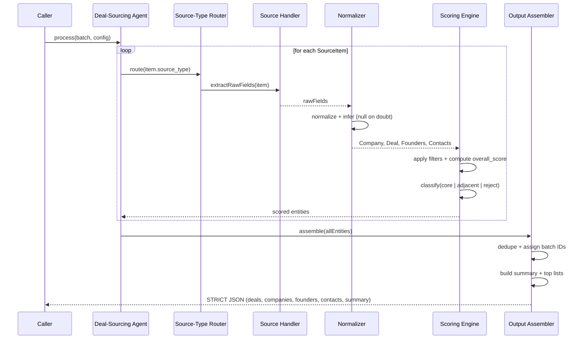
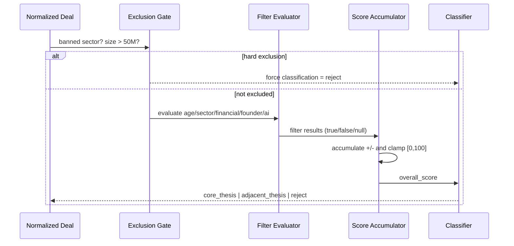

# Design Document: Deal-Sourcing & CRM Enrichment Agent (TransformBiz)

## Overview

The Deal-Sourcing & CRM Enrichment Agent is a deterministic, batch-oriented processing engine for an
investment/credit team. It ingests **pre-fetched** content (HTML / JSON / CSV plus metadata) describing
mid-market SME and franchise opportunities, normalizes that content into structured entities, applies a
documented investment thesis (age, sector, financial, founder, and AI-automation filters), scores and
classifies each opportunity, extracts contacts and relationship leads, and emits a single **strict JSON**
object that a downstream ETL writes into a database and CRM.

The agent is intentionally **non-scraping**: it never fetches live websites. Every unit of work arrives as a
`SourceItem` containing `source_name`, `source_type`, and `raw_text` (plus optional structured payloads). This
keeps the agent pure with respect to the outside world — its only inputs are the batch it is given, and its only
output is the JSON contract. This purity is what makes the behavior testable with property-based testing.

Two design principles dominate every decision below: **never fabricate data** (prefer `null` / `"unknown"` over
guessing) and **enforce exclusions strictly** (tobacco, liquor/alcohol-as-core, and gambling are always rejected;
deals clearly above ~50M EV are always rejected). Scoring is conservative: ambiguity lowers the score rather than
raising it, and marketing hype is never treated as financial evidence.

## Architecture



The pipeline is a linear, stateless transformation: `batch in -> JSON out`. No stage performs I/O against
external systems. The Thesis Config and Source Registry are injected (so `scaling.com.au` / `scalingup.com.au`
is a pre-registered marketplace source), keeping thresholds and source metadata out of the code paths.

## Sequence Diagrams

### Main batch-processing flow



### Per-item scoring decision flow



## Components and Interfaces

### Component 1: Ingestion & Batch Loader

**Purpose**: Accepts the input batch and validates its shape before processing.

**Interface**:
```pascal
INTERFACE IngestionLoader
  FUNCTION loadBatch(rawBatch): Batch          // validates structure, returns list of SourceItem
  FUNCTION validateSourceItem(item): Boolean   // ensures source_name, source_type, raw_text present
END INTERFACE
```

**Responsibilities**:
- Reject malformed batches early (missing `source_type`, missing `raw_text`).
- Guarantee every downstream stage receives well-formed `SourceItem` records.

### Component 2: Source-Type Router

**Purpose**: Dispatches each `SourceItem` to the correct source-type handler based on its `source_type` enum.

**Interface**:
```pascal
INTERFACE SourceRouter
  FUNCTION route(item): SourceHandler          // selects handler by source_type
END INTERFACE
```

**Responsibilities**:
- Map `source_type in {marketplace, broker_directory, insolvency_platform, chamber_directory, social, news}`
  to the matching handler.
- Fall back to a generic handler if the type is unknown (still no fabrication).

### Component 3: Source Handlers (one per source_type)

**Purpose**: Extract raw candidate fields from source-specific structure. Each handler knows the conventions of
its source family but produces a uniform `RawFields` record.

**Interface**:
```pascal
INTERFACE SourceHandler
  FUNCTION extractRawFields(item): RawFields    // pulls candidate values; NEVER invents data
  FUNCTION extractContacts(item): ContactList   // brokers, liquidators, officials, etc.
END INTERFACE
```

**Responsibilities by handler** (detailed in *Source-Type-Specific Handlers* below):
- `marketplace` / `broker_directory`: deal listings + broker contacts.
- `insolvency_platform`: distress opportunities + practitioner relationships.
- `chamber_directory`: off-market target firms + association relationship leads.
- `social` / `news`: signal extraction on sub-30–40M deals; lower trust on financial claims.

### Component 4: Normalizer & Inference Engine

**Purpose**: Convert `RawFields` into typed, validated entity fields. Performs conservative inference
(e.g. `age_years` from `founded_year`) and marks estimates.

**Interface**:
```pascal
INTERFACE Normalizer
  FUNCTION normalizeCompany(raw): Company
  FUNCTION normalizeDeal(raw): Deal
  FUNCTION normalizeFounders(raw): FounderList
  FUNCTION inferDealSizeBucket(deal): SizeBucket
  FUNCTION inferRecency(deal, now): RecencyInfo   // sets is_stale, handles unknown_date
END INTERFACE
```

**Responsibilities**:
- Null out any field that cannot be confidently extracted.
- Compute derived fields (`age_years`, `tenure_years`) only when source data supports them.
- Tag inferred numeric levels as `ESTIMATED`.

### Component 5: Thesis Filter & Scoring Engine

**Purpose**: Apply the five thesis filters, compute `overall_score`, and produce a `ThesisMatch`.

**Interface**:
```pascal
INTERFACE ScoringEngine
  FUNCTION evaluateFilters(company, deal, founders, config): FilterResults
  FUNCTION computeScore(filterResults, dataQuality): Integer   // clamped [0,100]
  FUNCTION classify(score, filterResults): Classification
  FUNCTION buildThesisMatch(deal, filterResults, score, classification): ThesisMatch
END INTERFACE
```

### Component 6: Contact & Relationship Extractor

**Purpose**: Build `Contact` records for brokers, liquidators, bankers, founders, and association officials,
annotated with the deal types / sectors / sizes they handle and their sourcing-strategy fit.

**Interface**:
```pascal
INTERFACE ContactExtractor
  FUNCTION buildContacts(items, founders): ContactList
  FUNCTION annotateRelevance(contact): Contact   // notes_on_relevance_to_deals + priority_reason
END INTERFACE
```

### Component 7: Prioritization & Output Assembler

**Purpose**: Deduplicate, assign per-batch IDs, compute the summary, build `top_core_thesis_deals` (<=20,
non-stale) and `top_contacts_for_outreach` (<=50), and serialize to the strict JSON contract.

**Interface**:
```pascal
INTERFACE OutputAssembler
  FUNCTION assignBatchIds(entities): IndexedEntities       // deal_001, company_001, ...
  FUNCTION buildSummary(deals, contacts): Summary
  FUNCTION selectTopDeals(deals): DealList                 // top 20 by score, exclude is_stale
  FUNCTION selectTopContacts(contacts): ContactList        // top 50 by deal-flow likelihood
  FUNCTION serialize(output): StrictJSON                   // no surrounding prose
END INTERFACE
```

## Data Models

All numeric currency fields carry an explicit `*_currency` companion and may be `null`. Every nullable field
defaults to `null` (or `"unknown"` for enum-like text) rather than a fabricated value.

### Model: Company

```pascal
STRUCTURE Company
  company_id: String                     // assigned at assembly: company_001
  name: String
  country: String
  state: String | NULL
  city: String | NULL
  postcode: String | NULL
  sector: String | NULL
  subsector: String | NULL
  founded_year: Integer | NULL
  age_years: Integer | NULL              // computed: current_year - founded_year
  employees: Integer | NULL
  banned_sector_flag: Boolean            // true if tobacco / liquor-core / gambling
  notes_about_business_model: String | NULL
END STRUCTURE
```

**Validation Rules**:
- `name` and `country` are required (non-empty).
- `age_years` is set only when `founded_year` is present; otherwise `null`.
- `banned_sector_flag = true` forces any associated deal to `reject`.

### Model: Deal

```pascal
STRUCTURE Deal
  deal_id: String                        // deal_001
  company_id: String | NULL
  source_name: String                    // REQUIRED
  source_type: SourceType                // REQUIRED
  external_listing_id_or_url: String     // REQUIRED
  title: String
  description: String | NULL
  deal_type: Enum(sale, franchise, distress, capital_raise, other)
  asking_price: Number | NULL
  asking_price_currency: String | NULL
  deal_size_bucket: Enum(small, lower_mid, core_mid, upper_mid, unknown)
  revenue: Number | NULL
  revenue_currency: String | NULL
  ebitda: Number | NULL
  ebitda_currency: String | NULL
  listing_date: Date | NULL
  last_seen_at: Date | NULL
  location_text: String | NULL
  is_franchise: Boolean
  competitive_notes: String | NULL
  ai_automation_potential_notes: String | NULL
  raw_source_excerpt: String
  is_stale: Boolean                      // true if older than 12 months
  thesis_match: ThesisMatch              // embedded scoring result
END STRUCTURE
```

**Validation Rules**:
- `source_name`, `source_type`, and `external_listing_id_or_url` are always present (non-null).
- `deal_size_bucket` defaults to `unknown` when financials/price are missing.
- A currency field must be present whenever its paired amount is non-null.

### Model: Founder / Key Person

```pascal
STRUCTURE Founder
  person_id: String                      // founder_001
  company_id: String | NULL
  name: String
  role: Enum(Founder, Director, Partner, Practitioner, Broker, Banker)
  start_year: Integer | NULL
  tenure_years: Integer | NULL           // computed when start_year known
  linkedin_url: String | NULL
  email: String | NULL
  phone: String | NULL
  organization_name: String | NULL
END STRUCTURE
```

**Validation Rules**:
- `tenure_years` derived only from a known `start_year`.
- `name` and `role` required.

### Model: Contact / Relationship Lead

```pascal
STRUCTURE Contact
  contact_id: String                     // contact_001
  person_or_org_name: String
  role_or_title: String | NULL
  sector_focus: String | NULL
  region_or_state: String | NULL
  linkedin_url: String | NULL
  portal_url_or_website: String | NULL
  email: String | NULL
  phone: String | NULL
  source_name: String                    // REQUIRED
  source_type: SourceType                // REQUIRED
  notes_on_relevance_to_deals: String | NULL
  priority_reason: String | NULL         // present only when in top_contacts_for_outreach
END STRUCTURE
```

**Validation Rules**:
- `source_name` and `source_type` always present.
- `priority_reason` is set only for contacts surfaced in the outreach list.

### Model: ThesisMatch (embedded in Deal)

```pascal
STRUCTURE ThesisMatch
  deal_id: String
  passes_age_filter: Boolean | NULL
  passes_sector_filter: Boolean | NULL
  passes_financial_filter: Boolean | NULL
  passes_founder_filter: Boolean | NULL
  ai_automation_potential_flag: Boolean | NULL
  overall_score: Integer                 // 0..100
  classification: Enum(core_thesis, adjacent_thesis, reject)
  explanation: String                    // one concise paragraph
END STRUCTURE
```

### Model: ThesisConfig (injected configuration)

```pascal
STRUCTURE ThesisConfig
  current_year: Integer
  min_trading_years: Integer             // 6
  min_founder_tenure_years: Integer      // 20
  min_revenue_usd: Number                // ~250000..300000
  min_ebitda_usd: Number                 // ~250000..300000
  ev_core_min: Number                    // ~10,000,000
  ev_core_max: Number                    // ~40,000,000
  ev_absolute_max: Number                // ~50,000,000
  recency_cutoff_months: Integer         // 12
  banned_sectors: SetOfString            // {tobacco, liquor/alcohol-core, gambling/betting/casino/gaming}
  preferred_sectors: SetOfString         // {manufacturing, bookkeeping/accounting, financial/professional services, ...}
  primary_geography: String              // Australia
END STRUCTURE
```

## Source-Type-Specific Handlers

Each handler reads its source family's conventions and emits uniform `RawFields`. None invents data.

```pascal
PROCEDURE handleMarketplace(item)        // includes scaling.com.au / scalingup.com.au
  INPUT: item (raw_text + optional structured listing)
  OUTPUT: RawFields
  SEQUENCE
    fields.deal_type     <- "sale"  OR "franchise" IF franchise portal markers present
    fields.title         <- extractListingTitle(item)
    fields.asking_price  <- extractPrice(item)              // null if absent
    fields.revenue       <- extractStatedRevenue(item)      // mark ESTIMATED if range
    fields.ebitda        <- extractStatedEbitda(item)
    fields.listing_date  <- extractListingDate(item)        // "unknown_date" if absent
    fields.is_franchise  <- detectFranchise(item)
    fields.contacts      <- extractBrokerContacts(item)
    RETURN fields
  END SEQUENCE
END PROCEDURE

PROCEDURE handleBrokerDirectory(item)
  // Primarily a source of CONTACTS + deal-origin meta; deals optional/sparse.
  SEQUENCE
    fields.contacts <- extractBrokers(item)   // role = Broker, annotate sector/size focus
    fields.deal_meta <- extractOriginMeta(item)
    RETURN fields
  END SEQUENCE
END PROCEDURE

PROCEDURE handleInsolvencyPlatform(item)
  // ASIC liquidators / AFSA trustees: distress/restructuring opportunities + practitioners.
  SEQUENCE
    fields.deal_type <- "distress"
    fields.contacts  <- extractPractitioners(item)  // role = Practitioner
    fields.company   <- extractDistressedEntity(item)
    RETURN fields
  END SEQUENCE
END PROCEDURE

PROCEDURE handleChamberDirectory(item)
  // Off-market target firms + relationship leads (association officials).
  SEQUENCE
    fields.company  <- extractMemberFirm(item)      // off-market target, deal optional
    fields.contacts <- extractAssociationOfficials(item)
    RETURN fields
  END SEQUENCE
END PROCEDURE

PROCEDURE handleSocialOrNews(item)
  // LinkedIn / X / RSS / news on sub-30-40M deals; treat financial claims with low trust.
  SEQUENCE
    fields.signal_text <- item.raw_text
    fields.company     <- extractMentionedCompany(item)
    fields.deal_hint   <- extractDealSignal(item)   // do NOT treat hype as financial evidence
    fields.contacts    <- extractMentionedPeople(item)
    RETURN fields
  END SEQUENCE
END PROCEDURE
```

## Normalization & Inference Logic

```pascal
ALGORITHM normalizeDeal(raw, company, config)
INPUT: raw (RawFields), company (Company), config (ThesisConfig)
OUTPUT: deal (Deal)

BEGIN
  deal.source_name <- raw.source_name                 // required, copied verbatim
  deal.source_type <- raw.source_type
  deal.external_listing_id_or_url <- raw.external_ref OR raw.url

  deal.title       <- raw.title
  deal.description <- raw.description OR NULL

  // Conservative numeric inference: ranges -> midpoint, marked ESTIMATED
  IF raw.revenue IS RANGE THEN
    deal.revenue <- midpoint(raw.revenue) ; tag(deal, "revenue=ESTIMATED")
  ELSE
    deal.revenue <- raw.revenue OR NULL
  END IF
  // same pattern for ebitda and asking_price

  deal.deal_size_bucket <- inferDealSizeBucket(deal, config)
  deal.is_franchise     <- raw.is_franchise OR false

  recency <- inferRecency(deal, config)
  deal.listing_date <- recency.listing_date           // "unknown_date" if missing
  deal.last_seen_at <- recency.last_seen_at
  deal.is_stale     <- recency.is_stale

  deal.raw_source_excerpt <- truncate(raw.raw_text)
  RETURN deal
END

ALGORITHM inferDealSizeBucket(deal, config)
INPUT: deal, config
OUTPUT: bucket in {small, lower_mid, core_mid, upper_mid, unknown}
BEGIN
  ev <- bestEstimateEV(deal)               // from asking_price or description; NULL if none
  IF ev = NULL THEN
    RETURN unknown                         // prefer unknown over guessing
  END IF
  IF ev > config.ev_absolute_max THEN RETURN upper_mid   // (also triggers reject later)
  IF ev >= config.ev_core_min AND ev <= config.ev_core_max THEN RETURN core_mid
  IF ev < config.ev_core_min THEN RETURN lower_mid OR small (by magnitude)
  RETURN unknown
END

ALGORITHM inferRecency(deal, config)
INPUT: deal, config
OUTPUT: recency (listing_date, last_seen_at, is_stale)
BEGIN
  IF deal.listing_date = NULL AND deal.last_seen_at = NULL THEN
    RETURN { listing_date: "unknown_date", last_seen_at: "unknown_date", is_stale: false }
    // unknown date => NOT marked stale, but also not eligible as a fresh top deal by date
  END IF
  reference <- mostRecent(deal.listing_date, deal.last_seen_at)
  ageMonths <- monthsBetween(reference, config.current_date)
  is_stale  <- (ageMonths > config.recency_cutoff_months)
  RETURN { listing_date: deal.listing_date, last_seen_at: deal.last_seen_at, is_stale: is_stale }
END
```

## Algorithmic Pseudocode (Scoring & Classification)

### Filter evaluation

```pascal
ALGORITHM evaluateFilters(company, deal, founders, config)
INPUT: company, deal, founders, config
OUTPUT: f (FilterResults with tri-state Boolean|NULL fields)

BEGIN
  // --- Age filter ---
  IF company.founded_year = NULL THEN
    f.passes_age_filter <- NULL
  ELSE IF (config.current_year - company.founded_year) >= config.min_trading_years THEN
    f.passes_age_filter <- true
  ELSE
    f.passes_age_filter <- false
  END IF

  // --- Sector filter ---
  IF company.banned_sector_flag = true THEN
    f.passes_sector_filter <- false
  ELSE IF company.sector IN config.preferred_sectors THEN
    f.passes_sector_filter <- true
  ELSE IF company.sector = NULL THEN
    f.passes_sector_filter <- NULL
  ELSE IF isSuitableServiceSector(company.sector) THEN
    f.passes_sector_filter <- true
  ELSE
    f.passes_sector_filter <- NULL        // allowed-if-stable; unknown until evidence
  END IF

  // --- Financial filter ---
  IF deal.revenue >= config.min_revenue_usd AND deal.ebitda >= config.min_ebitda_usd THEN
    f.passes_financial_filter <- true
  ELSE IF impliesHealthyMidMarket(deal, config) THEN   // price range 10-40M + healthy margins
    f.passes_financial_filter <- true
  ELSE IF deal.revenue = NULL AND deal.ebitda = NULL AND deal.asking_price = NULL THEN
    f.passes_financial_filter <- NULL
  ELSE
    f.passes_financial_filter <- false
  END IF

  // --- Founder filter ---
  bestTenure <- maxTenure(founders)
  IF bestTenure = NULL THEN
    f.passes_founder_filter <- NULL
  ELSE IF bestTenure >= config.min_founder_tenure_years OR hasMultiDecadeSectorHistory(founders) THEN
    f.passes_founder_filter <- true
  ELSE
    f.passes_founder_filter <- false
  END IF

  // --- AI/automation potential ---
  IF hasRecurringManualProcesses(deal, company) THEN
    f.ai_automation_potential_flag <- true
  ELSE IF isAssetHeavyLowComplexity(deal, company) THEN
    f.ai_automation_potential_flag <- false
  ELSE
    f.ai_automation_potential_flag <- NULL
  END IF

  RETURN f
END
```

**Preconditions**: `company`, `deal`, and `config` are well-formed; `founders` may be empty.
**Postconditions**: each filter field is exactly `true`, `false`, or `NULL`; `banned_sector_flag` always yields `passes_sector_filter = false`.

### Score computation

```pascal
ALGORITHM computeScore(f, dataQuality)
INPUT: f (FilterResults), dataQuality (count/severity of missing or vague fields)
OUTPUT: score in [0,100]

BEGIN
  score <- 0
  IF f.passes_sector_filter   = true THEN score <- score + 25
  IF f.passes_age_filter      = true THEN score <- score + 20
  IF f.passes_financial_filter = true THEN score <- score + 20
  IF f.passes_founder_filter  = true THEN score <- score + 15
  IF f.ai_automation_potential_flag = true THEN score <- score + 10

  // Conservative penalty for missing/vague info (up to 20)
  penalty <- min(20, dataQuality.missingPenalty)
  score <- score - penalty

  // Clamp
  IF score < 0 THEN score <- 0
  IF score > 100 THEN score <- 100
  RETURN score
END
```

**Preconditions**: `f` is a valid `FilterResults`; `dataQuality.missingPenalty >= 0`.
**Postconditions**: `0 <= score <= 100`; only `true` filters contribute positive points (`NULL`/`false` add nothing).

### Classification

```pascal
ALGORITHM classify(score, f, deal, config)
INPUT: score, f (FilterResults), deal, config
OUTPUT: classification in {core_thesis, adjacent_thesis, reject}

BEGIN
  // --- Hard exclusions take absolute precedence ---
  IF f.passes_sector_filter = false THEN RETURN reject          // banned/excluded sector
  IF clearlyTooLarge(deal, config) THEN RETURN reject           // EV > ~50M
  IF score < 40 THEN RETURN reject

  // --- Core thesis ---
  IF score >= 70 AND NOT hasExclusionFlag(f, deal) THEN
    RETURN core_thesis
  END IF

  // --- Adjacent thesis ---
  IF score >= 40 AND score < 70 THEN RETURN adjacent_thesis
  IF exactlyOneKeyFilterUnknown(f) AND othersStrong(f) THEN RETURN adjacent_thesis

  RETURN adjacent_thesis
END
```

**Preconditions**: `0 <= score <= 100`; `f` valid.
**Postconditions**: returns exactly one enum value; a `false` sector filter or oversized deal **always** yields `reject`; `score < 40` always yields `reject`; `score >= 70` with no exclusion yields `core_thesis`.

### Top-level orchestration

```pascal
ALGORITHM processBatch(batch, config)
INPUT: batch (list of SourceItem), config (ThesisConfig)
OUTPUT: output (StrictJSON)

BEGIN
  ASSERT validateBatch(batch) = true

  companies <- [] ; deals <- [] ; founders <- [] ; contacts <- []

  FOR each item IN batch DO
    ASSERT item.source_name <> NULL AND item.source_type <> NULL AND item.raw_text <> NULL

    handler <- route(item.source_type)
    raw     <- handler.extractRawFields(item)

    company  <- normalizeCompany(raw, config)
    deal     <- normalizeDeal(raw, company, config)
    people   <- normalizeFounders(raw)
    leads    <- handler.extractContacts(item)

    f      <- evaluateFilters(company, deal, people, config)
    score  <- computeScore(f, assessDataQuality(company, deal, people))
    cls    <- classify(score, f, deal, config)
    deal.thesis_match <- buildThesisMatch(deal, f, score, cls, explanation(f, cls))

    APPEND company TO companies
    APPEND deal TO deals
    APPEND people TO founders
    APPEND leads TO contacts
  END FOR

  indexed <- assignBatchIds(companies, deals, founders, contacts)   // *_001, *_002, ...
  summary <- buildSummary(indexed.deals, indexed.contacts)

  output <- {
    deals:     indexed.deals,
    companies: indexed.companies,
    founders:  indexed.founders,
    contacts:  indexed.contacts,
    summary:   summary
  }

  ASSERT isStrictValidJSON(output)
  RETURN output
END
```

**Loop Invariants**:
- After each iteration, every appended `Deal` has non-null `source_name` and `external_listing_id_or_url`.
- Every appended `Deal` carries a `thesis_match` whose `overall_score` is in `[0,100]`.
- No fabricated values have been introduced (each null-eligible field is either evidence-backed or null).

### Prioritization

```pascal
ALGORITHM buildSummary(deals, contacts)
INPUT: deals, contacts
OUTPUT: summary

BEGIN
  core     <- filter(deals, d -> d.thesis_match.classification = core_thesis)
  adjacent <- filter(deals, d -> d.thesis_match.classification = adjacent_thesis)
  rejected <- filter(deals, d -> d.thesis_match.classification = reject)

  // Top core deals: highest score first, EXCLUDE stale, cap 20
  topCore <- take(20,
               sortDescByScore(
                 filter(core, d -> d.is_stale = false)))

  // Top contacts: rank by deal-flow likelihood, cap 50, attach priority_reason
  ranked  <- sortDescByDealFlowLikelihood(contacts)   // brokers in 10-50M, SME insolvency, assoc leaders
  topCont <- take(50, ranked)
  FOR each c IN topCont DO c.priority_reason <- reasonFor(c) END FOR

  RETURN {
    core_thesis_deal_count:     count(core),
    adjacent_thesis_deal_count: count(adjacent),
    reject_count:               count(rejected),
    top_core_thesis_deals:      topCore,
    top_contacts_for_outreach:  topCont
  }
END
```

## Key Functions with Formal Specifications

### `computeScore(filterResults, dataQuality): Integer`
- **Preconditions**: `filterResults` valid; `dataQuality.missingPenalty >= 0`.
- **Postconditions**: result in `[0,100]`; monotonic — flipping any filter from non-true to `true` never decreases the score (penalty held constant).
- **Loop invariants**: none (no loops).

### `classify(score, filterResults, deal, config): Classification`
- **Preconditions**: `0 <= score <= 100`.
- **Postconditions**: total function returning one of three enum values; reject conditions dominate; mutually exclusive outcomes.
- **Loop invariants**: none.

### `inferRecency(deal, config): RecencyInfo`
- **Preconditions**: `deal` well-formed; `config.recency_cutoff_months > 0`.
- **Postconditions**: missing dates -> `"unknown_date"` and `is_stale = false`; a known date older than the cutoff -> `is_stale = true`.
- **Loop invariants**: none.

### `processBatch(batch, config): StrictJSON`
- **Preconditions**: `validateBatch(batch) = true`; every item has `source_name`, `source_type`, `raw_text`.
- **Postconditions**: output is strict valid JSON with keys `deals, companies, founders, contacts, summary`; every `Deal` has unique `deal_id` and non-null source provenance; `summary` counts equal the partition sizes of `deals` by classification.
- **Loop invariants**: see *Top-level orchestration* above.

## Example Usage

```pascal
SEQUENCE
  config <- loadThesisConfig()                  // thresholds + source registry (incl. scaling.com.au)

  batch  <- [
    SourceItem("scaling.com.au", marketplace,        raw_html_1),
    SourceItem("ASIC Liquidators", insolvency_platform, raw_json_2),
    SourceItem("Local Chamber AU",  chamber_directory, raw_csv_3),
    SourceItem("LinkedIn",          social,            raw_text_4)
  ]

  result <- processBatch(batch, config)

  // result is STRICT JSON only; downstream ETL consumes it directly
  DISPLAY result   // { "deals": [...], "companies": [...], "founders": [...],
                   //   "contacts": [...], "summary": {...} }
END SEQUENCE
```

### Illustrative output shape (single representative deal)

```pascal
{
  "deals": [
    {
      "deal_id": "deal_001",
      "company_id": "company_001",
      "source_name": "scaling.com.au",
      "source_type": "marketplace",
      "external_listing_id_or_url": "https://scaling.com.au/listing/abc",
      "title": "Established Packaging Manufacturer - VIC",
      "deal_type": "sale",
      "asking_price": null,
      "asking_price_currency": null,
      "deal_size_bucket": "core_mid",
      "revenue": 4200000, "revenue_currency": "AUD",
      "ebitda": 950000,  "ebitda_currency": "AUD",
      "listing_date": "2025-04-10", "last_seen_at": "2025-06-01",
      "is_franchise": false,
      "is_stale": false,
      "thesis_match": {
        "deal_id": "deal_001",
        "passes_age_filter": true,
        "passes_sector_filter": true,
        "passes_financial_filter": true,
        "passes_founder_filter": null,
        "ai_automation_potential_flag": true,
        "overall_score": 80,
        "classification": "core_thesis",
        "explanation": "Manufacturing (preferred) with >6 years trading and financials above threshold; founder tenure unknown; clear automation upside. No exclusion flags."
      }
    }
  ],
  "companies": [ /* company_001 ... */ ],
  "founders":  [ /* founder_001 ... */ ],
  "contacts":  [ /* contact_001 ... */ ],
  "summary": {
    "core_thesis_deal_count": 1,
    "adjacent_thesis_deal_count": 0,
    "reject_count": 0,
    "top_core_thesis_deals": [ /* up to 20 */ ],
    "top_contacts_for_outreach": [ /* up to 50 */ ]
  }
}
```

## JSON Output Contract

- The agent emits **strict JSON only** — no surrounding prose, no markdown fences in the actual output.
- Top-level keys (exactly): `deals`, `companies`, `founders`, `contacts`, `summary`.
- `deals[*]` embed `thesis_match`.
- IDs are unique within the batch: `deal_001`, `company_001`, `founder_001`, `contact_001`, ...
- Every `Deal` includes non-null `source_name` and `external_listing_id_or_url`.
- Every `Contact` includes non-null `source_name` and `source_type`.
- `summary.top_core_thesis_deals` has at most 20 entries, all non-stale, all `core_thesis`.
- `summary.top_contacts_for_outreach` has at most 50 entries, each with a `priority_reason`.
- Missing data is represented as `null` (or `"unknown"` / `"unknown_date"` for enum/date text), never invented.

## Correctness Properties

These are stated as universally-quantified invariants suitable for property-based testing. For every batch
`B` and config `C`, let `out = processBatch(B, C)`.

```pascal
// P1 Score range
FOR ALL d IN out.deals: 0 <= d.thesis_match.overall_score <= 100

// P2 Strict exclusion -> reject
FOR ALL d IN out.deals:
  (companyOf(d).banned_sector_flag = true) IMPLIES (d.thesis_match.classification = reject)

// P3 Oversized -> reject
FOR ALL d IN out.deals:
  clearlyTooLarge(d, C) IMPLIES (d.thesis_match.classification = reject)

// P4 Low score -> reject
FOR ALL d IN out.deals:
  (d.thesis_match.overall_score < 40) IMPLIES (d.thesis_match.classification = reject)

// P5 Core thesis floor
FOR ALL d IN out.deals:
  (d.thesis_match.classification = core_thesis) IMPLIES
     (d.thesis_match.overall_score >= 70 AND NOT hasExclusionFlag(d))

// P6 Provenance always present
FOR ALL d IN out.deals: d.source_name <> NULL AND d.external_listing_id_or_url <> NULL
FOR ALL c IN out.contacts: c.source_name <> NULL AND c.source_type <> NULL

// P7 ID uniqueness
allDistinct(map(out.deals, deal_id)) AND allDistinct(map(out.companies, company_id))
  AND allDistinct(map(out.founders, person_id)) AND allDistinct(map(out.contacts, contact_id))

// P8 Top deals bounds + non-stale + core only
length(out.summary.top_core_thesis_deals) <= 20
FOR ALL d IN out.summary.top_core_thesis_deals:
  d.is_stale = false AND d.thesis_match.classification = core_thesis

// P9 Top deals are score-ordered
isSortedDescByScore(out.summary.top_core_thesis_deals)

// P10 Top contacts bounds + reason present
length(out.summary.top_contacts_for_outreach) <= 50
FOR ALL c IN out.summary.top_contacts_for_outreach: c.priority_reason <> NULL

// P11 Summary counts partition the deals
out.summary.core_thesis_deal_count
  + out.summary.adjacent_thesis_deal_count
  + out.summary.reject_count = length(out.deals)

// P12 No fabrication of financials (range-derived values are flagged ESTIMATED)
FOR ALL d IN out.deals:
  (d.revenue <> NULL AND wasRangeDerived(d.revenue)) IMPLIES isFlaggedEstimated(d, "revenue")

// P13 Tri-state filters
FOR ALL d IN out.deals:
  each filter field IN {passes_age_filter, passes_sector_filter, passes_financial_filter,
                        passes_founder_filter, ai_automation_potential_flag}
  IS IN {true, false, NULL}

// P14 Score monotonicity (with penalty fixed)
FOR ALL filter sets f1, f2 where f2 has >= true-flags than f1 (same positions, penalty const):
  computeScore(f2, q) >= computeScore(f1, q)

// P15 Determinism
processBatch(B, C) = processBatch(B, C)   // identical output for identical input

// P16 Stale exclusion from top deals
FOR ALL d IN out.deals: d.is_stale = true IMPLIES d NOT IN out.summary.top_core_thesis_deals

// P17 Output is strict valid JSON with the required top-level keys
isStrictValidJSON(out) AND keys(out) = {deals, companies, founders, contacts, summary}
```

## Error Handling

### Scenario 1: Malformed batch / missing required source fields
- **Condition**: a `SourceItem` lacks `source_name`, `source_type`, or `raw_text`.
- **Response**: reject the item at ingestion; do not emit a partial/fabricated deal.
- **Recovery**: continue processing remaining valid items; record the skip count (not part of the strict JSON unless configured).

### Scenario 2: Unknown / unsupported `source_type`
- **Condition**: `source_type` not in the enum.
- **Response**: route to the generic handler, which extracts only safely-identifiable fields and nulls the rest.
- **Recovery**: the item still flows through scoring; ambiguity lowers its score.

### Scenario 3: Conflicting or contradictory financial signals
- **Condition**: revenue/EBITDA/price disagree or look like marketing hype.
- **Response**: treat unverifiable claims as absent (`null`); do not let hype set `passes_financial_filter = true`.
- **Recovery**: financial filter becomes `NULL` (unknown) and the data-quality penalty applies.

### Scenario 4: Missing dates
- **Condition**: no `listing_date` and no `last_seen_at`.
- **Response**: set both to `"unknown_date"`, `is_stale = false`, but exclude from date-based freshness ranking.
- **Recovery**: deal can still be scored/classified but is not guaranteed a top-deal slot.

### Scenario 5: Oversized or excluded opportunity
- **Condition**: EV clearly above ~50M, or banned sector detected.
- **Response**: force `classification = reject` regardless of other strengths.
- **Recovery**: deal is counted in `reject_count` and excluded from all top lists.

## Testing Strategy

### Unit Testing Approach
- Test each filter (`age`, `sector`, `financial`, `founder`, `ai_automation`) across `true / false / NULL` cases.
- Test `computeScore` additive points and the capped penalty, including clamping at 0 and 100.
- Test `classify` boundaries: score 39/40, 69/70; banned sector; oversized deal.
- Test each source handler with representative raw payloads (including the configured `scaling.com.au` source).
- Test `inferRecency` for the 12-month cutoff and the `"unknown_date"` path.

### Property-Based Testing Approach
- Generate random batches of `SourceItem`s (varied source types, partial/missing fields, edge financials, banned
  sectors, oversized EV) and assert properties **P1–P17** above hold for every generated batch.
- Key invariants to fuzz hardest: exclusion dominance (P2, P3), score range/monotonicity (P1, P14),
  summary partitioning (P11), top-list bounds and non-staleness (P8, P16), and determinism (P15).
- **Property Test Library**: `fast-check` (TypeScript) or `hypothesis` (Python), depending on the implementation
  language chosen at build time. The agent's pure `batch -> JSON` shape makes it ideal for PBT.

### Integration Testing Approach
- Feed a mixed multi-source batch end-to-end and validate the emitted JSON against the output contract schema.
- Confirm the downstream ETL can parse the JSON without prose contamination (strict-JSON guarantee, P17).

## Performance Considerations

- Processing is `O(n)` in the number of `SourceItem`s for normalization/scoring, plus `O(n log n)` for the
  top-deal and top-contact sorts. Batches are expected to be modest (hundreds to low thousands), so a single
  pass with two sorts is sufficient.
- All work is in-memory and stateless; no per-item network calls. Memory scales linearly with batch size.
- Deduplication during assembly is `O(n)` using hash keys on `(source_name, external_listing_id_or_url)`.

## Security Considerations

- **No live fetching**: the agent never makes outbound requests, eliminating SSRF and scraping-abuse risk.
- **Untrusted input**: `raw_text` is treated as untrusted data, never executed or interpolated into queries.
- **PII handling**: contact emails/phones/LinkedIn URLs are carried only when present in source data; no
  enrichment from external lookups. Downstream storage should apply its own access controls and retention rules.
- **No fabrication** also reduces compliance risk: the agent will not assert financials or identities it cannot
  substantiate from the provided source.

## Dependencies

- A JSON serializer guaranteeing strict, prose-free output.
- A date library for month/year arithmetic (recency cutoff, age/tenure).
- An injected `ThesisConfig` + Source Registry (includes the configured `scaling.com.au` / `scalingup.com.au`
  marketplace source and the banned/preferred sector sets).
- A property-based testing library (`fast-check` or `hypothesis`) for the correctness properties.
- No external network services, databases, or live scrapers are required by the agent itself; the downstream
  ETL/DB/CRM are out of scope for this component.
```
