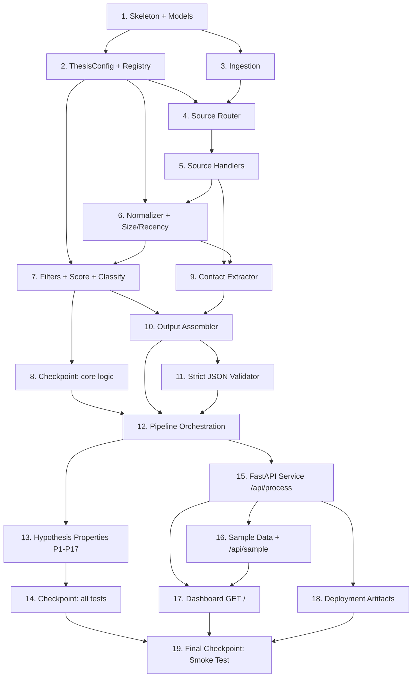

# Implementation Plan: Deal-Sourcing & CRM Enrichment Agent (TransformBiz)

## Overview

This plan implements the Deal-Sourcing & CRM Enrichment Agent as a **deployable FastAPI web
service with a server-rendered dashboard**, ready to push to GitHub and host on Render.

- **Language / runtime**: Python 3.11
- **Backend**: FastAPI + Uvicorn implementing the full pure pipeline
  (Ingestion -> Source Router -> Source Handlers -> Normalizer -> Scoring Engine -> Classifier ->
  Contact Extractor -> Output Assembler -> Strict JSON Validator).
- **Models**: Pydantic v2 models for `ThesisConfig`, `Company`, `Deal` (embedding `ThesisMatch`),
  `Founder`, `Contact`, and the `SourceItem` / batch request / output contract.
- **API**: `POST /api/process` accepting `{batch, config?}` and returning the strict JSON output
  contract; `GET /` serving the dashboard.
- **Dashboard**: server-rendered HTML + vanilla JS (no build step) in `static/`, with a
  "Load sample data" button backed by a bundled demo batch.
- **Testing**: `pytest` unit tests for every filter/score/classify boundary, plus `hypothesis`
  property-based tests asserting correctness properties **P1–P17**.
- **Deployment artifacts**: `requirements.txt`, `render.yaml`, `Procfile`, `.gitignore`, `README.md`.

### Repository layout (ALL code lives OUTSIDE `.kiro/specs`)

```
deal-sourcing/                      <- repo root
  app/
    __init__.py
    main.py                         <- FastAPI app, routes (GET /, POST /api/process)
    models.py                       <- Pydantic models + enums
    config.py                       <- ThesisConfig defaults + source registry
    ingestion.py                    <- batch + SourceItem validation
    router.py                       <- source-type router
    handlers.py                     <- one handler per source_type + generic + contacts
    normalizer.py                   <- normalization, inference, recency, size bucket
    scoring.py                      <- filters, computeScore, classify, ThesisMatch
    contacts.py                     <- contact build + relevance/priority annotation
    assembler.py                    <- dedupe, IDs, summary, top lists, serialize
    validator.py                    <- strict JSON validation
    pipeline.py                     <- process_batch orchestration
    sample_data.py                  <- bundled demo batch
  static/
    index.html                      <- dashboard markup
    app.js                          <- vanilla JS: load/run batch, render results
    styles.css                      <- dashboard styling
  tests/
    __init__.py
    test_ingestion.py
    test_handlers.py
    test_normalizer.py
    test_scoring.py
    test_classify.py
    test_assembler.py
    test_validator.py
    test_api.py
    test_properties.py              <- hypothesis P1–P17
    strategies.py                   <- hypothesis generators
    test_smoke.py                   <- app starts + sample batch -> valid strict JSON
  requirements.txt
  render.yaml
  Procfile
  .gitignore
  README.md
```

> NOTE: `tasks.md` (this markdown file) is the only artifact that lives under
> `.kiro/specs/deal-sourcing-agent/`. Every `.py`, `.html`, `.js`, `.css`, and deployment file is
> created at the repo root tree shown above.

---

## Tasks

- [x] 1. Set up project skeleton, dependencies, and Pydantic data models
  - Create `app/` package with `__init__.py` and an empty module set so imports resolve.
  - Create `requirements.txt` (fastapi, uvicorn[standard], pydantic>=2, jinja2/optional, pytest, hypothesis, httpx for TestClient).
  - In `app/models.py`, define enums (`SourceType`, `DealType`, `DealSizeBucket`, `Classification`, `FounderRole`) and Pydantic models: `SourceItem`, `Company`, `ThesisMatch`, `Deal` (embedding `ThesisMatch`), `Founder`, `Contact`, `Summary`, `ProcessOutput`, and the request body `ProcessRequest {batch, config?}`.
  - Encode nullability defaults: every null-eligible field defaults to `None`; enum-like text defaults to `"unknown"`; ensure currency companion fields exist for each amount.
  - _Requirements: 10.1, 10.2, 10.3, 10.4, 12.1_

  - [x]* 1.1 Write unit tests for model construction and null defaults
    - Assert models accept minimal valid input and default null-eligible fields to `None`/`"unknown"`.
    - Assert a currency companion field is required-present whenever its paired amount is set.
    - _Requirements: 3.7, 10.1, 12.10_

- [x] 2. Implement injected ThesisConfig and source registry
  - In `app/config.py`, define `ThesisConfig` defaults: `current_year`, `min_trading_years=6`, `min_founder_tenure_years=20`, `min_revenue_usd`, `min_ebitda_usd` (~250k–300k), `ev_core_min=10_000_000`, `ev_core_max=40_000_000`, `ev_absolute_max=50_000_000`, `recency_cutoff_months=12`, `banned_sectors`, `preferred_sectors`, `primary_geography="Australia"`.
  - Register `scaling.com.au` / `scalingup.com.au` as a `marketplace` source in the source registry.
  - Provide `load_thesis_config(overrides?)` so config is injected, never hard-coded into logic paths.
  - _Requirements: 2.3, 4.2, 4.7, 4.10, 5.3, 5.5, 7.3, 15.4_

  - [x]* 2.1 Write unit tests for config defaults and source registry
    - Assert thresholds match the design and that `scaling.com.au` resolves to `marketplace`.
    - _Requirements: 2.3, 15.4_

- [x] 3. Implement Ingestion & Batch Loader
  - In `app/ingestion.py`, implement `load_batch(raw_batch)` validating the batch is a well-formed list and `validate_source_item(item)` requiring non-empty `source_name`, present `source_type`, non-empty `raw_text`.
  - Reject invalid items without emitting partial/fabricated deals; continue with valid items and return a `skipped_count`.
  - Guarantee no outbound network calls occur anywhere in this module.
  - _Requirements: 1.1, 1.2, 1.3, 1.4, 1.5_

  - [x]* 3.1 Write unit tests for ingestion validation and skip behavior
    - Test missing each required field is rejected; valid items pass; `skipped_count` is accurate.
    - _Requirements: 1.2, 1.3, 1.4_

- [x] 4. Implement Source-Type Router
  - In `app/router.py`, implement `route(item)` mapping `source_type` to its handler for `marketplace`, `broker_directory`, `insolvency_platform`, `chamber_directory`, `social`, `news`.
  - Route registered `scaling.com.au` / `scalingup.com.au` items to the marketplace handler.
  - Fall back to a generic handler for unknown `source_type` (extract only safely-identifiable fields, null the rest).
  - _Requirements: 2.1, 2.2, 2.3, 2.4_

  - [x]* 4.1 Write unit tests for routing
    - Assert each supported type and the `scaling.com.au` source dispatch correctly; unknown types use the generic handler.
    - _Requirements: 2.1, 2.2, 2.3, 2.4_

- [x] 5. Implement Source Handlers
  - In `app/handlers.py`, implement `extract_raw_fields(item)` and `extract_contacts(item)` for each source family plus a generic handler. None may invent data.
    - marketplace: deal listing fields + broker contacts; `deal_type` sale/franchise.
    - broker_directory: broker contacts annotated with sector/deal-size focus; deals optional.
    - insolvency_platform: `deal_type=distress`, practitioner contacts, distressed entity.
    - chamber_directory: off-market target firm + association-official leads.
    - social/news: company + deal-signal extraction; never treat hype as financial evidence.
  - _Requirements: 2.5, 2.6, 2.7, 2.8, 2.9, 2.10, 11.1_

  - [x]* 5.1 Write unit tests for each handler with representative payloads
    - Include a `scaling.com.au` marketplace payload, an insolvency payload, a chamber payload, and a social payload; assert no fabricated fields and correct `deal_type`.
    - _Requirements: 2.5, 2.6, 2.7, 2.8, 2.9, 2.10_

- [x] 6. Implement Normalizer & Inference Engine
  - In `app/normalizer.py`, implement `normalize_company`, `normalize_deal`, `normalize_founders`, `infer_deal_size_bucket`, and `infer_recency`.
  - Null out non-extractable fields; compute `age_years` from `founded_year` and `tenure_years` from `start_year`; derive range values to a single value flagged `ESTIMATED`; populate `*_currency` when amounts are set; never treat hype as financial evidence.
  - Implement franchise handling (`is_franchise=true`, `deal_type=franchise`, capture unit-economics notes).
  - _Requirements: 3.1, 3.2, 3.3, 3.4, 3.5, 3.6, 3.7, 3.8, 6.1, 6.2, 6.3, 10.1, 10.2, 10.4_

  - [x]* 6.1 Write unit tests for normalization and inference boundaries
    - Test null-on-doubt, age/tenure derivation, range->ESTIMATED, currency pairing, franchise tagging.
    - Covers **P12** (range-derived -> ESTIMATED).
    - _Requirements: 3.1, 3.2, 3.3, 3.4, 3.5, 3.6, 3.7, 6.1_

  - [x] 6.2 Implement deal-size bucketing
    - Map EV to `core_mid` (10–40M), `lower_mid`/`small` below core, `unknown` when no EV; surface oversized so the classifier can reject.
    - _Requirements: 5.1, 5.2, 5.3, 5.4, 5.5_

  - [x]* 6.3 Write unit tests for size bucketing and recency
    - Test EV boundaries (just under/over core min, oversized), no-EV -> `unknown`, and the 12-month staleness cutoff plus `"unknown_date"` path (`is_stale=false`).
    - _Requirements: 5.2, 5.3, 5.4, 7.1, 7.2, 7.3, 7.4_

- [x] 7. Implement Thesis Filter & Scoring Engine
  - In `app/scoring.py`, implement `evaluate_filters` producing tri-state outcomes for all five filters, including banned-sector forcing `passes_sector_filter=false`, preferred-sector logic, financial/age/founder rules, AI-automation flag, and Australian geography handling.
  - _Requirements: 4.1, 4.2, 4.3, 4.4, 4.5, 4.6, 4.7, 4.8, 4.9, 4.10, 4.11, 4.12_

  - [x]* 7.1 Write unit tests for each filter across true/false/null
    - One test per filter covering each tri-state outcome; banned sector always false; absent data -> null.
    - Covers **P13** (tri-state) at the unit level.
    - _Requirements: 4.1, 4.2, 4.3, 4.4, 4.5, 4.6, 4.7, 4.9, 4.10, 4.11_

  - [x] 7.2 Implement `compute_score`
    - Additive points (sector 25, age 20, financial 20, founder 15, AI 10), penalty up to 20, clamp `[0,100]`; only `true` filters add points.
    - _Requirements: 8.1, 8.2, 8.3, 8.4, 8.5, 8.6, 8.7, 8.8, 8.9_

  - [x]* 7.3 Write unit tests for scoring math and clamping
    - Test additive contributions, penalty cap, clamping at 0 and 100, and that false/null add nothing.
    - Covers **P1** (range) and supports **P14** (monotonicity) at unit level.
    - _Requirements: 8.1, 8.7, 8.8, 8.9_

  - [x] 7.4 Implement `classify` and `build_thesis_match`
    - Hard exclusions dominate (banned sector, oversized, score<40 -> reject); score>=70 & no exclusion -> core_thesis; 40–69 -> adjacent; one-key-unknown-others-strong -> adjacent; produce concise filter-citing explanation.
    - _Requirements: 9.1, 9.2, 9.3, 9.4, 9.5, 9.6, 9.7, 9.8, 13.2, 13.3, 13.5_

  - [x]* 7.5 Write unit tests for classification boundaries
    - Test score 39/40 and 69/70 boundaries, banned sector reject, oversized reject, one-key-unknown adjacent path, and explanation content.
    - Covers **P2, P3, P4, P5** at the unit level.
    - _Requirements: 9.2, 9.3, 9.4, 9.5, 9.6, 9.7_

- [x] 8. Checkpoint - core logic
  - Ensure all unit tests for ingestion, routing, handlers, normalizer, scoring, and classify pass. Ask the user if questions arise.

- [x] 9. Implement Contact & Relationship Extractor
  - In `app/contacts.py`, implement `build_contacts(items, founders)` for brokers, liquidators, bankers, founders, and association officials, and `annotate_relevance` writing `notes_on_relevance_to_deals` when derivable.
  - Ensure `source_name`/`source_type` always present; leave `priority_reason` unset here (assigned only in the outreach list).
  - _Requirements: 11.1, 11.2, 11.4, 12.4_

  - [x]* 9.1 Write unit tests for contact extraction and relevance notes
    - Test each contact role is built with non-null source provenance and relevance notes when derivable.
    - _Requirements: 11.1, 11.2, 12.4_

- [x] 10. Implement Output Assembler
  - In `app/assembler.py`, implement `assign_batch_ids` (`deal_NNN`, `company_NNN`, `founder_NNN`, `contact_NNN`), dedupe on `(source_name, external_listing_id_or_url)`, `build_summary` (counts + top lists), `select_top_deals` (<=20, non-stale, core only, score-desc), `select_top_contacts` (<=50, attach `priority_reason`), and `serialize`.
  - Ensure summary counts partition the deals exactly.
  - _Requirements: 7.5, 10.5, 11.3, 12.2, 12.3, 12.5, 12.6, 12.7, 12.8, 12.10_

  - [x]* 10.1 Write unit tests for assembly, summary, and top lists
    - Test ID uniqueness, summary partitioning, top-deals bounds/ordering/non-stale, top-contacts bounds + priority_reason.
    - Covers **P7, P8, P9, P10, P11, P16** at the unit level.
    - _Requirements: 7.5, 12.2, 12.6, 12.7, 12.8_

- [x] 11. Implement Strict JSON Validator
  - In `app/validator.py`, implement `is_strict_valid_json(output)` verifying serializable strict JSON with exactly the top-level keys `deals`, `companies`, `founders`, `contacts`, `summary`, and no surrounding prose.
  - _Requirements: 12.1, 12.9_

  - [x]* 11.1 Write unit tests for the validator
    - Test exact top-level key set acceptance and rejection of extra/missing keys.
    - Covers **P17** at the unit level.
    - _Requirements: 12.1, 12.9_

- [x] 12. Wire the pipeline orchestration
  - In `app/pipeline.py`, implement `process_batch(batch, config)` chaining ingestion -> route -> handlers -> normalize -> filters -> score -> classify -> contacts -> assemble -> validate, returning the strict `ProcessOutput`.
  - Guarantee determinism (no randomness, stable sort tie-breakers) and no outbound network calls.
  - _Requirements: 12.9, 13.1, 13.6, 15.2_

  - [x]* 12.1 Write integration-style unit test for the full pipeline
    - Feed a mixed multi-source batch and assert a valid strict output with embedded `thesis_match` per deal.
    - Covers **P6** and **P15** (determinism) at integration level.
    - _Requirements: 12.1, 12.3, 13.6_

- [x] 13. Implement hypothesis generators and property-based tests (P1–P17)
  - In `tests/strategies.py`, build hypothesis strategies generating varied batches: mixed source types, partial/missing fields, edge financials, banned sectors, oversized EV, stale/unknown dates.
  - In `tests/test_properties.py`, assert all correctness properties (min 100 iterations each), each tagged `Feature: deal-sourcing-agent, Property N: <text>`.
  - _Requirements: 14.1–14.17, 13.6_

  - [x]* 13.1 Property: score range and tri-state filters
    - **Property P1: 0 <= overall_score <= 100**; **Property P13: every filter field in {true,false,null}**.
    - **Validates: Requirements 14.1, 14.13**
  - [x]* 13.2 Property: exclusion dominance
    - **Property P2: banned_sector -> reject**; **Property P3: oversized -> reject**; **Property P4: score<40 -> reject**.
    - **Validates: Requirements 14.2, 14.3, 14.4**
  - [x]* 13.3 Property: core-thesis floor
    - **Property P5: classification=core_thesis -> score>=70 AND no exclusion flag**.
    - **Validates: Requirements 14.5**
  - [x]* 13.4 Property: provenance and ID uniqueness
    - **Property P6: deals have source_name & external_listing_id_or_url; contacts have source_name & source_type**; **Property P7: all IDs distinct**.
    - **Validates: Requirements 14.6, 14.7**
  - [x]* 13.5 Property: top lists and summary partition
    - **Property P8: top deals <=20, non-stale, core only**; **Property P9: top deals score-desc**; **Property P10: top contacts <=50 with priority_reason**; **Property P11: counts partition deals**; **Property P16: stale excluded from top deals**.
    - **Validates: Requirements 14.8, 14.9, 14.10, 14.11, 14.16**
  - [x]* 13.6 Property: no fabrication, monotonicity, determinism, strict JSON
    - **Property P12: range-derived values flagged ESTIMATED**; **Property P14: score monotonic with penalty fixed**; **Property P15: identical input -> identical output**; **Property P17: strict valid JSON with exact top-level keys**.
    - **Validates: Requirements 14.12, 14.14, 14.15, 14.17**

- [x] 14. Checkpoint - all tests
  - Ensure all unit and property-based tests pass. Ask the user if questions arise.

- [x] 15. Implement the FastAPI service and Processing_Endpoint
  - In `app/main.py`, create the FastAPI app, mount `static/`, implement `POST /api/process` accepting `{batch, config?}` -> calls `process_batch` -> returns strict JSON; inject `ThesisConfig` (with overrides from request `config`) rather than hard-coding.
  - Return a descriptive error (HTTP 4xx) for malformed requests (missing/non-list batch, absent required config) without emitting partial/fabricated output; perform no outbound calls.
  - _Requirements: 15.1, 15.2, 15.3, 15.4, 15.6, 12.9_

  - [x]* 15.1 Write API tests with FastAPI TestClient
    - Test `POST /api/process` returns valid strict JSON for a good batch and a descriptive error for malformed requests.
    - Covers **P17** end-to-end via the HTTP layer.
    - _Requirements: 15.2, 15.3_

- [x] 16. Add the bundled sample/demo batch
  - In `app/sample_data.py`, define a demo batch including a `scaling.com.au` marketplace item, an `insolvency_platform` item, a `chamber_directory` item, and a `social` item that produce real, varied results (core/adjacent/reject).
  - Expose `GET /api/sample` returning the sample batch so the dashboard can load it.
  - _Requirements: 2.3, 2.5, 2.7, 2.8, 2.9, 15.2_

  - [x]* 16.1 Write a test that the sample batch processes to valid strict JSON
    - Assert the bundled sample runs through `process_batch` producing valid output with at least one core and one reject deal.
    - _Requirements: 12.9, 15.2_

- [x] 17. Build and wire the dashboard (GET /)
  - In `static/index.html`, `static/app.js`, `static/styles.css`, build a no-build-step dashboard served at `GET /` that lets the user paste/load a batch and POSTs to `/api/process`.
  - Render: summary cards (core/adjacent/reject counts), a sortable deals table with score + classification badges + thesis filter chips, a companies panel, a founders panel, and a top-contacts-for-outreach list showing `priority_reason`.
  - Add a "Load sample data" button that fetches `GET /api/sample`, runs it through `/api/process`, and visualizes results on load.
  - _Requirements: 15.1, 12.5, 12.6, 12.7, 9.1_

- [x] 18. Write deployment artifacts for GitHub + Render
  - Create `requirements.txt` (pinned), `render.yaml` (Render web service: build `pip install -r requirements.txt`, start `uvicorn app.main:app --host 0.0.0.0 --port $PORT`), `Procfile` (`web: uvicorn app.main:app --host 0.0.0.0 --port $PORT`), `.gitignore` (Python venv/cache/`.kiro` optional), and `README.md` with local-run and Render one-click deploy instructions.
  - _Requirements: 15.5_

- [x] 19. Final checkpoint - smoke test the deployable service
  - In `tests/test_smoke.py`, start the app via FastAPI TestClient, assert `GET /` returns the dashboard HTML, and assert `POST /api/process` with the bundled sample batch returns valid strict JSON with exactly the keys `deals, companies, founders, contacts, summary`.
  - Covers **P17** end-to-end and verifies the app boots for Render.
  - Ensure all tests pass. Ask the user if questions arise.
  - _Requirements: 15.1, 15.2, 12.1, 12.9_

---

## Task Dependency Graph



## Notes

- Tasks marked with `*` are optional test sub-tasks and can be skipped for a faster MVP; core
  implementation tasks are never optional.
- Each task references specific requirement sub-clauses for traceability, and test sub-tasks note
  which correctness properties (P1–P17) they cover.
- Property tests run a minimum of 100 iterations each and are tagged
  `Feature: deal-sourcing-agent, Property N: <text>`.
- All application, static, test, and deployment files live at the repo root (outside
  `.kiro/specs/`); only this `tasks.md` resides in the spec folder.
- Checkpoints (Tasks 8, 14, 19) provide incremental validation before moving on.
```